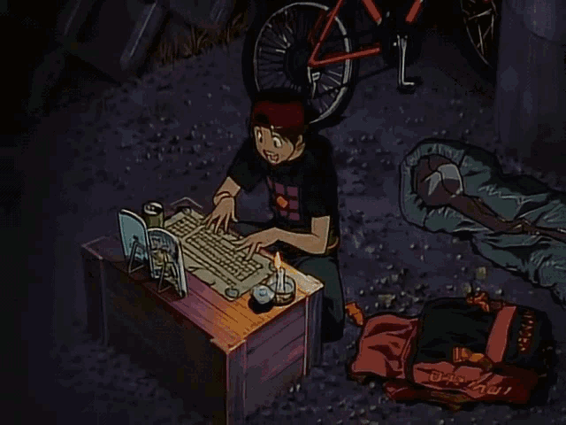

  

 

<table border="0" cellpadding="0" cellspacing="0">
  <tr>
    <td width="30%" valign="top">
      
    </td>
    <td width="70%" valign="top">
      

### IT Specialist · CS Student · Researcher · NACCE STEM Instructor

  
  
  
  

  
  
  
  

  
  
  

</td>
</tr>
</table>

---

### About Me

Hi, I'm Sam

-  **IT Specialist** · Hawaii State Department of Education
-  **CS Student** · Oregon State University (Cybersecurity Concentration)
-  **Honors** · University of Hawaiʻi Maui College, Information & Computer Sciences (2025)
-  **NACCE STEM Achievers Instructor** · University of Hawaiʻi Maui College
-  **Research** · NASA ACRES (live fuel moisture) · NSF RAPID wildfire recovery · Cyberinfrastructure REU · Oceanit coastal engineering
-  Based in **Maui, Hawaiʻi**
-  Into video games, anime, and art

---

### Tech Stack

  
  
  
  
  
  
  
  
  
  
  
  
  
  
  
  
  
  
  
  
  
  

---

### Research

| Project | Role | Funder |
|---|---|---|
| [Maui Wildfire Recovery](https://maui-fire.ikewai.org/) | Named Contributor - NSF RAPID grant briefed to Senator Mazie Hirono's office (Nov 2023). Collaborated with University at Buffalo to validate the SWUIFT fire spread model against documented Lahaina fire progression using NCAR wind simulations. Geospatial modeling with ArcGIS Pro and HPC. | NSF RAPID |
| [Coastal Erosion Monitoring](https://oceanit.com/how-students-powered-mauis-coastal-community-climate-change-toolkit-program/) | Student Ambassador and Coastal Engineer - Oceanit Climate Change Toolkit protecting Paia Mantokuji Temple. Automated environmental monitoring with Python, MATLAB, and ReoLink cameras. Hawaii State Senate recognition. | Oceanit |
| [Climate Change at Mantokuji](https://arcg.is/0iifCz) | Interactive ArcGIS StoryMap documenting coastal erosion and sea level rise threatening the historic Mantokuji Mission in Paia, Maui. Covers GIS monitoring and three preservation strategies. | Oceanit |
| CITRUS Program | Research Intern - Hawaii Data Science Institute REU-style program (Jun 2024). Climate-focused data science and visualization using HPC systems. | NSF / HIDSI |
| Cyberinfrastructure REU | REU Researcher - CC* KoaStore project at UH System (Jan to May 2024). Built on-demand HPC applications (MATLAB, TensorBoard, Code-Server) and ran performance benchmarks for UH Koa cluster. | NSF / UH System |

---

### Active Development

| Project | Current Phase |
|---|---|
| **NASA ACRES** | Coming Soon |

---

### GitHub Activity & Stats

  

  

---

### Contact

💼 **LinkedIn:** <a href="https://www.linkedin.com/in/samdameg/" target="_blank">Click Here</a> 
🌐 **Portfolio:** <a href="https://portfolio-hazel-eight-1eo8p12f3a.vercel.app/" target="_blank">Click Here</a> 
🎖️ **Credly:** <a href="https://www.credly.com/users/sam-dameg" target="_blank">Click Here</a> 
📄 **Resume:** <i>Coming soon</i>

---

  

